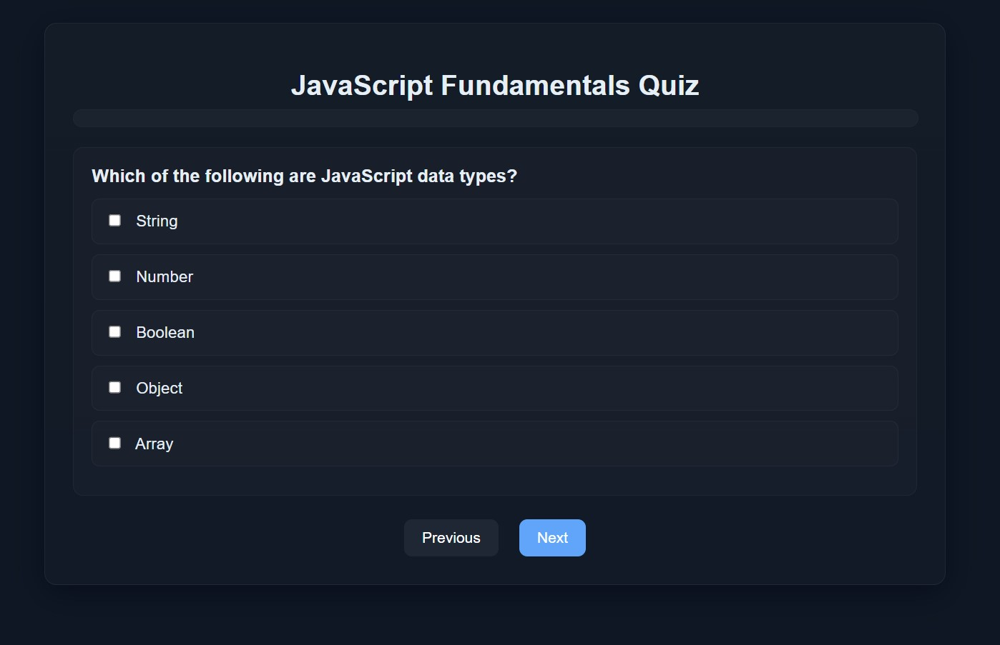

# Quizz Web Page

A modular quiz web application built with Vite that renders interactive quizzes from JSON data with support for multiple question types.



## Features

- 📝 **Multiple Question Types**: Multiple Choice, Single Choice, and Text Input
- 🔧 **Modular Architecture**: Easy to extend with new question types
- 📊 **Progress Tracking**: Real-time progress bar and completion statistics
- ⏱️ **Timer**: Tracks time taken to complete the quiz
- 🔄 **Navigation**: Move between questions and review answers
- 📱 **Responsive Design**: Clean, mobile-friendly interface

## Quick Start

```bash
# Install dependencies
npm install

# Start development server
npm run dev

# Build for production
npm run build

# Preview production build
npm run preview
```

## Quiz JSON Format

```json
{
  "name": "My Quiz Title",
  "Questions": [
    {
      "name": "Question text here?",
      "type": "Multiple Choice",
      "answer": ["Option 1", "Option 2", "Option 3"]
    },
    {
      "name": "Single selection question?",
      "type": "Single Choice",
      "answer": ["Choice A", "Choice B", "Choice C"]
    },
    {
      "name": "What is your answer?",
      "type": "Input",
      "answer": ["Expected answer text"]
    }
  ]
}
```

## Supported Question Types

- **Multiple Choice**: Checkboxes allowing multiple selections
- **Single Choice**: Radio buttons for single selection
- **Input**: Text input field for free-form answers

## Extending with New Question Types

See [EXTENDING.md](EXTENDING.md) for detailed instructions on adding custom question types.

## Architecture

- **QuizzCore**: Manages quiz data and navigation
- **QuizzRender**: Handles rendering with pluggable question types
- **QuizzProgress**: Tracks answers and completion status
- **Question Renderers**: Modular components for each question type
